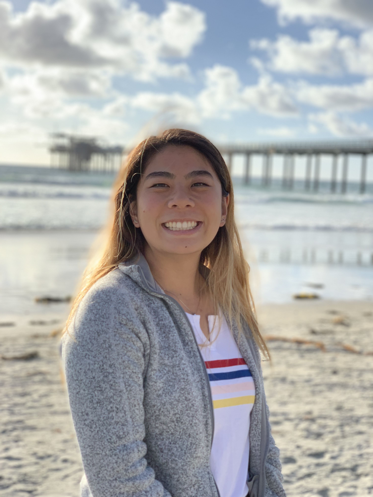

# Welcome to Peony Lum's GitHub Page!

## :sparkles: A Little Bit About Me... :sparkles:
 <br />
I am currently a third year student at UCSD, majoring in Computer Science and minoring in Design. I am most interested in UI/UX Design and Frontend 
Development, though I really want to learn about all types of cutting-edge technology. On my free time, I enjoy drawing, painting, and art in general.

### Fun Facts 
- My favorite programming language is **Java** :coffee:
- My hometown is **San Francisco** :bridge_at_night:
- A quote I live by: 
> I am ready to face any challenge that is foolish enough to face me - Dwight Schrute (The Office)
- A piece of code I live by:
```
while(noSuccess) {
  tryAgain();
  if(Dead) {
    break;
  }
}
```

### Me Summarized in Pictures


**Disclaimer: Though I believe these 3 images capture the essence of who I am, I do actually have much more to me than the 3 images above!**

**Learn more about my professional experiences by checking out [my LinkedIn profile](https://linkedin.com/in/peony-lum)**

## :computer: Why Computer Science? :computer:
When I was a Senior in High School, I took AP Computer Science, and while I was not great at programming then, I was intrigued by the concept of programming and creating software. I was incredibly hesitant to choose to major in Computer Science, and instead almost majored in Biology. Yet, the excitement I would get when seeing my code compile and run successfully was too much to ignore. I am now ~~dreaming of the day that I can call myself a Computer Scientist~~ a ***Computer Scientist in training***. 

## :bar_chart: My Experience with Different Programming Languages :bar_chart:
| Novice | Intermediate | Advanced |
| :----: | :----------: | :------: |
| C | - | - |
| Python | - | - |
| JavaScript | - | - |
| - | C++ | - |
| - | - | Java |

## :book: My Favorite Courses I Have Taken So Far at UCSD :book:
1. CSE 8B <br/>
   - *Though this course was challenging, I truly learned and experienced what coding was*
2. DSGN 1 <br/>
   - *This course inspired me to minor in design, it made me feel passionate about wanting to design UI/UX*
3. COGS 187A <br/>
   - *I learned all about wireframing and prototyping in this course, true wonders!*

## :white_check_mark: What I Want to Achieve *Before* Graduation :white_check_mark:
- [x] Get experience in frontend development
- [x] Become extremely involved in a school club
- [ ] Become a better programmer
- [ ] Become a better student

## :mortar_board: Top Three Things I want to Achieve *After* Graduation :mortar_board:
1. Land a job within the Software Engineering realm
2. Figure out what I want to pursue within the SE realm
3. Absolutely Love my career

[***Back to Top***](#welcome-to-peony-lum's-github-page!)
